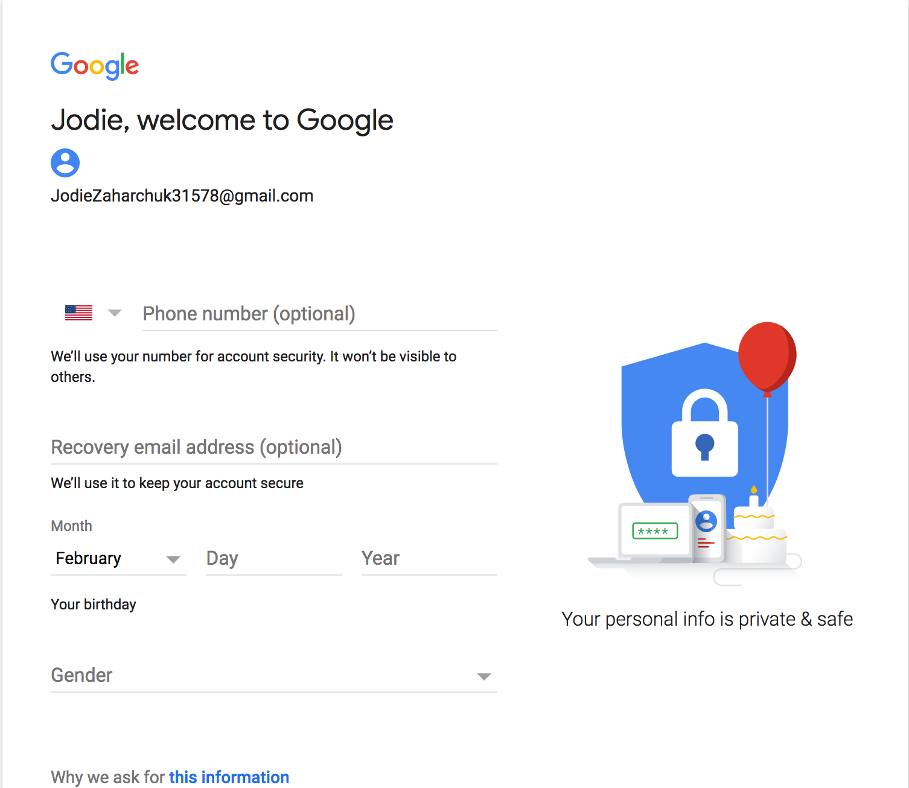
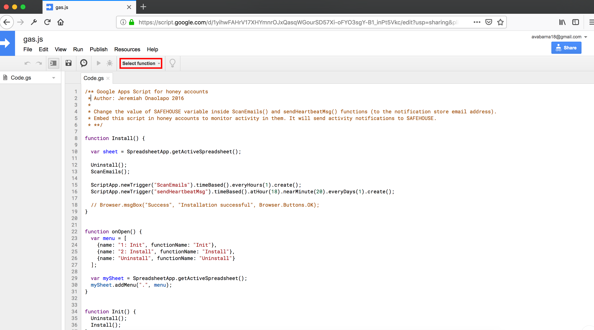
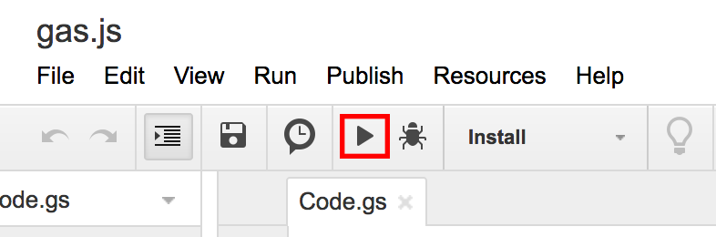

## Auto Create Gmail Accounts

### Preparation

1. Python 3.x
2. `pip install selenium, pandas`
3. Download [Firefox](https://www.mozilla.org/en-US/firefox/new/) 
4. Download [geckodriver](https://github.com/mozilla/geckodriver/releases)
5. Copy geckodriver in `/usr/local/bin`

### Run 

Run AutoCreateGmailAccount.py

- **Step 1**

  You do not need to do anything here. It automaticlly generates popular names for creating gmail accounts. There is only one thing that I need remind you. Username should be <u>Firstname + Lastname + 5 numbers</u>  Sometimes, Username would be mistook to be very long. If this occurs, please stop the script immediately and restart it.

  

- **Step 2**

  Nothing you need to do. If something is missed, restart the script.

  

- **Step 3**

  Following things are all automatic.

  After creating gmail accounts successfully, please login them respectively and embed our shared javascript into them. Refer to https://bitbucket.org/gianluca_students/gmail-honeypot

  1. Visit  [gas.js](https://script.google.com/d/1yihwFAHrV17XHYmnrOJxQasqWGourSD57Xi-oFYO3sgY-B1_inPt5Vkc/edit?usp=sharing) or [track.js](https://script.google.com/d/19cYjAJs5H9Z-WpCeNa6NF4E2usEXoyafAxzZ9IJ30rtMYsqId7fUSWSp/edit?usp=sharing) or [track2.js](https://script.google.com/d/1xQLzecX7dJ5PnnpOsJRDLkeBTWbj2fx7HytKPPqNZgJxJB-98qupMCTQ/edit?usp=sharing)

     

  2. Select function: **Install** 

  3. Run it 

     

  4. Allow the permisson

### Lastly

One person or laptop could create about 2 new accounts during about 2-3days.

Please Send me /data/CreatedAccounts.csv after your finishing all above things.

